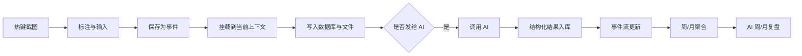
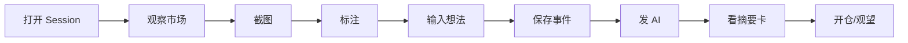
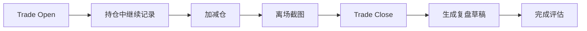
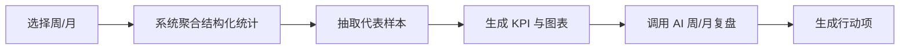

# AlphaNexus 设计文档

版本：v1.0  
日期：2026-03-25  
状态：设计方案初稿  
产品定位：本机优先的交易记录、AI 分析、复盘与周期聚合工作台

---

## 1. 项目概述

AlphaNexus 是一个面向交易者的本机桌面工作台，用来把盯盘过程中的截图、标注、想法、交易执行、AI 分析、交易结果、周报与月报聚合为一条可追溯、可统计、可复盘的信息主线。

它不是传统的聊天工具，也不是单纯的笔记工具，更不是只有交易表格的 journal。  
它的目标是同时解决以下问题：

1. 在盯盘过程中快速截图、快速标注、快速输入想法。
2. 将多张图、多周期、多来源信息送给 AI 做深度分析和短摘要。
3. 将开仓、加减仓、离场与对应的 AI 观点绑定成一条完整交易线程。
4. 用事件流形式展示一天的观察、判断、执行和结果。
5. 将每天的记录自动聚合成周/月级别的统计与 AI 复盘。
6. 长期沉淀用户自己的交易方法、错误模式和 AI 协同质量。

一句话定义：

> AlphaNexus 是一个“以截图与事件流为中心的交易认知操作系统”。

---

## 2. 产品愿景

### 2.1 愿景

建立一个真正可持续的交易工作台，让交易者在实时市场中记录判断，在交易结束后复盘执行，在周月周期中识别模式，并借助多 AI 形成可验证的辅助决策和训练闭环。

### 2.2 核心价值

- 把零散的截图和零散想法变成结构化交易资产。
- 把“看盘、下单、总结”从断裂动作变成一条连续主线。
- 把 AI 从泛泛而谈的评论员变成可审计的辅助分析者。
- 把长期复盘从“翻旧图”和“凭印象总结”升级为有证据的周/月训练系统。

### 2.3 不做的事情

- 不直接作为自动下单系统。
- 不试图替代专业行情终端。
- 不把所有功能做成纯云端依赖。
- 不把 AI 的自由文本输出当作唯一事实来源。

---

## 3. 设计理念

AlphaNexus 的产品设计遵循以下理念。

### 3.1 人优先，AI 辅助

系统首先服务用户自己的判断、记录和复盘。  
AI 是增强器，不是主导者。  
界面中“我的看法”“我的执行”“我的复盘”必须始终与 AI 并列展示。

### 3.2 事件优先，而不是文档优先

交易认知不是按章节发生的，而是按时间发生的。  
因此系统以事件流为骨架，将截图、想法、AI 输出、交易操作、复盘结果都记为事件，再在此之上形成交易线程和周期复盘。

### 3.3 结构化优先，而不是只有长文本

AI 输出必须同时包含：

- 深度分析
- 摘要卡
- 结构化字段

用户输入也应尽量保留结构化提取能力，例如方向、入场区、止损、止盈、标签、置信度。

### 3.4 Word 一样顺手，但底层可统计

交互体验应尽量像 Word 或文档编辑器一样自然：

- 点哪里写哪里
- 自动保存
- 直接粘贴图片
- 块可拖拽
- 删除可撤销

但底层不能只是自由文本，而必须知道每一段内容属于哪个上下文、哪个事件、哪笔交易、哪个周期。

### 3.5 本机优先

截图、标注、悬浮输入、热键、多窗口联动、本地文件落盘、本地数据库都应在本机完成。  
云端 API 只负责模型调用，不控制用户核心资产。

### 3.6 深度分析与快速执行并存

盯盘时需要的是干脆结论：

- 看涨/看空/震荡
- 入场区
- 止损
- 止盈
- 失效条件
- 成功概率

复盘时需要的是复杂推理：

- 上下文结构
- 行为偏差
- 方法问题
- 市场环境判断

两者必须分层展示。

### 3.7 建议优先于自动覆盖

AlphaNexus 应支持 AI 生成候选标注、候选结论和候选文本，但这些内容默认只能以“建议”的身份出现，不能直接覆盖用户原始记录。

系统必须明确区分：

- 用户正式标注
- AI 候选标注
- 用户已采纳的 AI 建议
- 进入后续上下文记忆的正式锚点

只有在用户明确保留或采纳之后，AI 给出的区域、标签或文本才可进入长期记忆和后续分析链路。

---

## 4. 用户与使用场景

### 4.1 目标用户

- 需要日内盯盘并频繁截图记录的主动交易者
- 使用多周期图、DOM、Footprint、热力图、期权信息进行决策的交易者
- 希望用 AI 辅助判断、复盘和训练的交易者
- 希望长期沉淀方法论与错误模式的交易者

### 4.2 关键场景

#### 场景 A：盯盘中的快速观察

用户看到一个潜在 setup，按热键截图，圈出关键区域，在右侧输入一句观点，保存并立即送给 AI，几秒内得到：

- 当前市场判断
- 入场区/止损/止盈
- 失效条件
- 简短理由

#### 场景 B：交易执行

用户开仓后继续追加截图和备注，将后续管理与 AI 的进一步点评挂到同一笔交易上。

#### 场景 C：离场复盘

用户离场时再截一张图，系统自动将其作为 Exit 图挂到当前交易，并生成“计划 vs 实际 vs 结果”的复盘草稿。

#### 场景 D：日内总结

用户在当天结束后回看事件流，补充事后复盘，标记 AI 和自己判断是否正确。

#### 场景 E：周/月训练

系统聚合某一周或某一月的数据，展示统计、模式、错误热度，并由 AI 生成周评或月评。

---

## 5. 产品边界

### 5.1 MVP 范围

- 合约选择
- 新建/继续 Session
- 截图、标注、悬浮输入
- 保存为事件
- 单 AI 或多 AI 分析
- Trade 生命周期记录
- Session 事件流展示
- Markdown + 图片 + SQLite 本地存储
- 删除与撤销
- 周/月聚合基础统计
- AI 周/月复盘

### 5.2 后续版本可扩展

- OCR 和价格轴校准
- 自动识别关键价位并精确画在图上
- 接入实际成交和行情回放数据
- 概率校准
- 自定义知识库和方法论模板
- 云同步和团队协作

---

## 6. 核心信息模型

AlphaNexus 的信息模型应统一为“上下文 + 事件 + 内容块”。

### 6.1 上下文层级

- Workspace
- Contract
- Period
- Session
- Trade
- Event
- Content Block

### 6.2 核心对象

#### Contract

一个交易对象，例如 NQ、ES、BTC、某期权链。

#### Period

周期聚合对象，例如：

- 2026-03
- 2026-W13
- 2026-03-25

#### Session

一个盯盘时段，例如：

- 2026-03-25 AM
- 2026-03-25 Night

#### Trade

一笔从开仓到离场的完整交易。

#### Event

一个按时间发生的动作或观察，例如：

- 截图
- 我的想法
- AI 分析
- 开仓
- 加仓
- 减仓
- 离场
- 复盘
- 评估

#### Content Block

Event 下面的具体内容块，是编辑、移动、删除、恢复的最小单位。

块类型包括：

- 文本块
- 图片块
- 标注块
- AI 摘要块
- AI 深度分析块
- 交易计划块
- 评估块
- 标签块

---

## 7. 挂载模型与默认上下文

用户强调：

- 截图默认挂到当前事件流
- 如果不是当前主线，要可以挂到历史交易或历史周期

因此系统必须有一个显式的 `Current Context`。

### 7.1 Current Context 定义

Current Context 是系统当前默认的归属目标，包含：

- 当前合约
- 当前 Period
- 当前 Session
- 当前 Trade
- 当前视图来源

### 7.2 默认挂载规则

1. 新截图默认挂到当前 Session。
2. 如果当前有激活中的 Trade，优先提示挂到该 Trade。
3. 如果用户正在查看某个历史 Trade，则默认挂到该 Trade。
4. 如果用户在周/月复盘页创建笔记，则默认挂到当前周期对象。
5. 所有新建块都允许更改挂载目标。

### 7.3 目标选择器

任意新内容都应支持修改挂载目标，目标选择器支持以下能力：

- 当前目标
- 最近目标
- 历史 Session 列表
- 历史 Trade 列表
- 搜索
- 快速跳转到“前一周期第 N 笔交易”

示例：

```text
保存到：当前 Trade #03 [更改]

可选目标：
- 当前 Session
- 当前 Trade #03
- 今日第 1 笔交易
- 今日第 2 笔交易
- 上一周期 > 第 3 笔交易
- 搜索...
```

### 7.4 移动规则

任何内容块都允许在父级之间移动：

- 从 Session 移到 Trade
- 从 Trade 移到 Session
- 从本周复盘移到某个历史 Trade

系统必须保留移动历史。

---

## 8. 核心功能设计

### 8.1 合约与 Session

#### 功能目标

- 进入系统后快速选择合约
- 新建或继续某个盯盘 Session
- 按月归档

#### 功能细节

- 合约支持搜索和收藏
- Session 支持 AM / PM / Night / Custom
- 每个 Session 自动关联日期和时区
- 可设置默认合约和默认 Session 桶

### 8.2 截图与标注

#### 功能目标

实现最短路径：

`热键截图 -> 标注 -> 输入观点 -> 保存 -> 发 AI`

#### 支持的截图模式

- 区域截图
- 窗口截图
- 全屏截图

#### 支持的标注工具

- 矩形
- 圆形
- 线
- 箭头
- 文本

#### 标注交互规则

- 自动编号，例如 B1、B2、L1、A1
- 编号显示在图上
- 标注颜色可切换
- 图层可开关
- 保存原图、标注图、标注 JSON

#### 右侧悬浮输入框

截图时右侧自动出现输入框，用于记录：

- 当时的市场想法
- 计划
- 情绪
- 风险提示

这部分内容必须和截图一起归档并可送给 AI。

#### 标注的语义化

标注不能只保存几何图形，还必须支持语义字段：

- 自动编号，例如 B1、B2、L1、A1、T1
- 用户标题，例如“重要支撑位”
- 语义类型，例如 support、resistance、liquidity、fvg、imbalance
- 备注
- 指向关系，例如 A1 指向 B2
- 是否加入后续记忆

这使系统后续记住的不是“某张图左上角的框”，而是“某合约某周期的关键区域语义”。

#### AI 候选标注

AI 可以基于当前截图、已有标注、用户观点与知识规则，生成候选区域和候选说明，例如：

- `AI-B1`：可能的支撑区
- `AI-L1`：关键失效线
- `AI-A1`：预期路径箭头

但这些候选标注默认只属于某次 AI 运行，不自动进入正式记录。用户必须显式选择：

- 保留
- 合并到已有标注
- 丢弃

#### 锚点记忆

当用户确认某个标注后，系统可将其升级为一个可跨截图、跨事件延续的 `Market Anchor`。

锚点应至少包含：

- 来源标注
- 价格区间或价位
- 语义类型
- 适用品种
- 适用周期
- 当前状态（active / invalidated / archived）
- 失效条件
- 是否自动带入后续 AI

### 8.3 事件流

#### 事件流是产品主骨架

AlphaNexus 的主展示模式不是文档章节，而是时间事件流。

#### 事件类型

- Screenshot
- User Note
- AI Analysis
- Trade Open
- Trade Add
- Trade Reduce
- Trade Exit
- Review
- Evaluation
- System Summary

#### 事件流要求

- 按时间排序
- 支持筛选
- 支持折叠
- 支持按 Trade 高亮
- 支持从事件跳转到交易线程

### 8.4 交易线程

一笔交易是从开仓到离场的完整单元。

#### 交易线程中至少要包含

- Setup 图
- 持仓中图
- Exit 图
- 我的原始计划
- AI 当时建议
- 实际执行记录
- 事后复盘
- 结果评估

#### 离场截图规则

离场截图是强信号事件，系统应提供：

- 一键保存为 Exit 图
- 若当前有未关闭交易，优先挂到该 Trade
- 自动生成结果评估草稿

### 8.5 AI 分析

AI 输出分两层：

#### 深度分析

包含：

- 当前市场结构
- 多周期联动
- 流动性与价格行为解释
- 风险与机会
- 替代情景

#### 摘要卡

包含：

- 看涨/看空/震荡
- 入场区
- 止损
- 止盈
- 失效条件
- 成功概率
- 反转概率
- 一句话理由

#### 结构化输出字段

```json
{
  "bias": "bullish",
  "confidence_pct": 70,
  "reversal_probability_pct": 40,
  "entry_zone": { "low": 5238, "high": 5242 },
  "stop_loss": { "price": 5229 },
  "take_profit": [{ "price": 5268 }, { "price": 5284 }],
  "invalidation": {
    "price": 5229,
    "reason": "跌破回踩承接区并延续"
  },
  "summary_short": "看涨，回踩 5238-5242 做多，止损 5229。"
}
```

### 8.6 人工记录与复盘

用户的内容分两类：

- 原始记录
- 事后复盘

两者必须分开存放，不互相覆盖。

#### 原始记录

用于还原当时的真实认知。

#### 事后复盘

用于总结偏差、问题和改进动作。

### 8.7 删除、恢复与可编辑性

系统必须支持：

- 删除单张图片
- 删除单次 AI 输出
- 删除任意笔记块
- 删除整个事件
- 删除整笔交易
- 从回收站恢复
- 删除后撤销

删除应采用软删除机制，并保留历史以避免统计断裂。

### 8.8 周/月聚合与复盘

系统应自动按日、周、月聚合：

- 交易数
- 胜率
- 净收益
- 平均 R
- 回撤
- 错误模式
- setup 表现
- AI 一致率

在此基础上由 AI 生成：

- 周评
- 月评
- 行动建议

---

## 9. 展示层设计

AlphaNexus 的展示层采用桌面应用中的 Web UI。  
推荐运行形态：

- 外壳：Electron
- 展示：React + TypeScript

这能兼顾：

- 高度灵活的 UI
- 全局热键
- 截图能力
- 本地文件系统
- 本地数据库
- 多窗口与悬浮层

---

## 10. UI 设计原则

用户要求展示“干净、清爽、好看”。  
UI 必须克制、稳定、专业，不做行情软件式噪声堆叠。

### 10.1 风格定位

- 研究工作台，而不是噪声型看盘工具
- Light First
- 清爽、低噪声、高层级
- 信息结构优先于装饰

### 10.2 视觉原则

- 大块留白
- 明确的卡片边界
- 清晰的时间轴
- 中性色为主，方向色为辅
- 只有关键判断使用强对比色

### 10.3 推荐配色

| 用途 | 颜色 |
| --- | --- |
| 页面背景 | `#F5F3EE` |
| 卡片背景 | `#FFFEFB` |
| 边框 | `#E6E1D7` |
| 主文字 | `#16181D` |
| 次文字 | `#6B7280` |
| 交互强调 | `#0F766E` |
| 看涨 | `#117A65` |
| 看空 | `#C44536` |
| 中性 | `#9A6B2F` |
| 信息蓝 | `#1D4ED8` |

### 10.4 推荐字体

- 中文：Source Han Sans SC
- 英文标题：IBM Plex Sans
- 数字价格：JetBrains Mono

### 10.5 组件视觉规范

- 圆角：12px
- 输入框高度：40px 或 44px
- 卡片内边距：16px 至 20px
- 阴影：极轻
- 分割线：浅色细线

---

## 11. 主要页面设计

### 11.1 首页

目标是帮助用户快速回到工作状态。

#### 模块

- 今日进行中 Session
- 最近使用的合约
- 最近交易
- 本周 KPI 快照
- 快速入口

#### 草图

```text
┌──────────────────────────────────────────────────────────────┐
│ AlphaNexus | New Session | Continue | Reviews | Settings    │
├──────────────────────────────────────────────────────────────┤
│ Continue NQ AM Session                                      │
│ 最近 Trade                                                  │
│ 本周表现快照                                                │
│ 快捷入口：新截图 / 新观点 / 新交易 / 周报 / 月报           │
└──────────────────────────────────────────────────────────────┘
```

### 11.2 Session 工作台

这是盯盘主界面，是产品最核心页面。

#### 三栏布局

- 左：事件流
- 中：图像与内容画布
- 右：工作台与检查器

#### 草图

```text
┌──────────────────────────────────────────────────────────────────────────┐
│ Contract | Period | Session | Current Context | Search | Capture | AI   │
├──────────────────┬───────────────────────────────────┬──────────────────┤
│ Timeline         │ Canvas / Content                 │ Workbench         │
│                  │                                   │                  │
│ 14:05 Screenshot │ 当前图 / 多图 tabs / 三联图       │ 我的实时看法       │
│ 14:06 My Note    │                                   │                  │
│ 14:07 GPT        │ 图像 + 标注图层                  │ AI 摘要卡          │
│ 14:09 Claude     │                                   │                  │
│ 14:12 Open Long  │ 文档式块编辑区                    │ 当前交易计划       │
│ 14:36 Exit       │                                   │                  │
│ 14:40 Review     │                                   │ 属性 / 删除 / 移动 │
└──────────────────┴───────────────────────────────────┴──────────────────┘
```

#### 页面目标

- 不离开此页即可完成盯盘主流程
- 支持边看图边写
- 支持多图对照
- 支持在当前上下文中快速生成记录

### 11.3 Trade 交易线程页

#### 草图

```text
┌──────────────────────────────────────────────────────────────┐
│ Trade #03 | NQ | Long | Closed | +1.8R                      │
├──────────────────────────────────────────────────────────────┤
│ Setup 图        | Manage 图         | Exit 图               │
├──────────────────────────────────────────────────────────────┤
│ 我的原始计划     | AI 当时建议        | 实际执行              │
├──────────────────────────────────────────────────────────────┤
│ 偏差分析         | 结果评估           | 下次改进              │
└──────────────────────────────────────────────────────────────┘
```

#### 页面目标

- 让一笔交易的前因后果一眼看懂
- 明确计划与执行之间的偏差
- 形成可复用的案例库

### 11.4 周/月复盘页

#### 草图

```text
┌──────────────────────────────────────────────────────────────┐
│ Month 2026-03 | NQ | Net +12.5R | Win 48%                  │
├──────────────────────────────────────────────────────────────┤
│ KPI 卡：交易数 / 平均R / 回撤 / 纪律分 / AI一致率          │
├──────────────────────────────────────────────────────────────┤
│ 盈亏曲线       | 时间段热力图      | Setup 排行             │
├──────────────────────────────────────────────────────────────┤
│ 错误标签排行   | AI与人工分歧      | 最佳/最差样本          │
├──────────────────────────────────────────────────────────────┤
│ AI 月评        | 我的月总结        | 下月行动项             │
└──────────────────────────────────────────────────────────────┘
```

#### 页面目标

- 从统计中发现规律
- 从代表样本中解释规律
- 形成下周期行动计划

### 11.5 截图标注弹层

#### 功能目标

- 快
- 稳
- 不打断看盘

#### 草图

```text
┌──────────────────────────────────────────────────────────────┐
│ [截图区域]                                                  │
│                                                              │
│      图像标注区                                              │
│                                                              │
├──────────────────────────────────────────────────────────────┤
│ 工具：矩形 圆 线 箭头 文字                                  │
│ 保存到：当前 Trade #03 [更改]                               │
│ 右侧：观点输入框                                             │
│ 按钮：保存 / 保存并发AI / 保存为Exit                         │
└──────────────────────────────────────────────────────────────┘
```

### 11.6 目标选择器

#### 功能目标

允许用户把任何内容挂到任意历史上下文。

#### 关键能力

- 当前目标
- 最近目标
- 历史树
- 搜索
- 快速定位“上一周期第 3 笔交易”

### 11.7 回收站

#### 功能目标

- 允许恢复误删内容
- 支持查看删除来源
- 支持彻底清除

---

## 12. 编辑体验设计

用户要求“跟 Word 一样简单方便”。  
因此编辑器设计不能是传统后台表单，而应采用“块编辑器 + 文档式交互”。

### 12.1 编辑体验原则

- 点哪里就能写
- 直接粘贴图片
- 自动保存
- 撤销/重做
- 块拖拽排序
- 选中即可格式化
- 双击直接编辑标题
- Backspace 删除空块

### 12.2 块类型

- Text Block
- Image Block
- AI Summary Block
- AI Deep Analysis Block
- Trade Plan Block
- Review Block
- Evaluation Block
- Divider Block

### 12.3 插入方式

输入 `/` 弹出插入菜单：

- `/text`
- `/image`
- `/ai-summary`
- `/trade-plan`
- `/review`
- `/divider`

### 12.4 块级能力

每个块都支持：

- 编辑
- 拖拽
- 复制链接
- 改挂载目标
- 删除
- 恢复

### 12.5 原始记录与复盘分离

为避免“事后知道结果后重写历史”，系统必须区分：

- 当下记录
- 事后复盘

界面上应明显标注：

- 我的当下看法
- 我的事后复盘

### 12.6 上下文感知输入层

AlphaNexus 的主输入框不应只是一个普通文本框，而应是一个带上下文感知能力的 `Composer`。

它的目标是让用户在不离开主流程的前提下，快速记录盘中判断，同时保持足够的结构化能力。

#### Composer 的三层预填能力

第一层：快捷候选

- 像输入法候选词一样，点击即插入
- 适合短语、判断句、风险提示

第二层：结构化模板

- 基于当前场景生成半成品模板
- 例如：观点 / 关键区域 / 触发条件 / 失效条件 / 执行计划

第三层：续写建议

- 根据用户已输入的内容继续补全
- 例如输入“B2 如果”，系统给出多条可选后续句式

#### Composer 的上下文来源

候选内容应来自以下信息的组合，而不是单一固定词库：

- 当前截图
- 当前选中的标注或锚点
- 上一个截图或最近关键截图
- 当前 Session 最近事件
- 当前激活中的 Trade
- 最近一次 AI 摘要
- 已命中的知识卡
- 用户常用表达历史

#### Composer 的交互原则

- 预填只提供建议，不自动覆盖用户原文
- 用户可点击选择，也可完全忽略自己写
- 任何建议插入后都可继续编辑
- 选中不同标注或锚点时，候选栏应即时变化
- 接受过的候选应记入本地历史，用于优化后续排序

#### Composer 的展示形式

推荐采用：

- 输入框上方的候选 Chips
- 输入框右侧的预填面板
- `/` 菜单触发模板和结构化插入
- 与当前选中锚点联动的上下文建议栏

### 12.7 AI 标注建议与文本建议分层

AI 在主界面中的产物应拆分为三类，不得混为一个自由文本响应：

- 结构化分析卡
- 候选标注层
- 候选文本建议层

这三类内容的可见性和持久化策略必须不同：

- 分析卡默认入事件流
- 候选标注默认不入正式记录
- 候选文本默认不入正式笔记
- 只有用户采纳后的内容才进入长期上下文

---

## 13. AI 设计

### 13.1 多 AI 支持

系统应允许同时接入：

- OpenAI
- Claude
- 第三方 API

### 13.2 AI 角色分工

#### 当前市场分析

输入：

- 多张截图
- 标注数据
- 用户当下观点
- 当前 Session 最近上下文
- 当前 open trade

输出：

- 深度分析
- 摘要卡
- 结构化交易建议

#### 交易级复盘

输入：

- Setup 图
- Exit 图
- 用户原始计划
- 实际执行
- 结果

输出：

- 正确点
- 偏差点
- 下次改进

#### 周/月复盘

输入：

- 聚合统计
- 代表案例
- 用户周期总结

输出：

- 周/月总评
- 优势模式
- 错误模式
- 下阶段行动项

### 13.3 AI 输出标准化

不同模型都必须落成同一套 schema，便于比较和统计。

### 13.4 共识视图与分歧视图

在多 AI 情况下，系统可展示：

- 共识方向
- 共识关键区域
- 主要分歧点
- 激进/保守差异

### 13.5 AI 不是唯一真相

AI 输出应始终与：

- 用户原始观点
- 用户执行
- 结果评估

并列展示。

---

## 14. 记忆系统设计

AlphaNexus 的“记忆”不应依赖聊天上下文，而应依赖本地结构化检索。

### 14.1 记忆来源

- 当前 Session 最近关键事件
- 当前 Trade
- 历史相似 Trade
- 用户方法论规则
- 历史错误模式库

### 14.2 知识包类型

- 市场基础知识包
- 用户自定义方法论
- 错误模式库
- 周/月复盘总结

### 14.2.1 知识导入链路

知识库不应要求用户手工从零录入所有内容。系统应支持把书籍、文章、课程笔记等资料导入，并通过模型抽取形成结构化知识卡。

推荐链路：

`文档导入 -> 分块 -> 模型抽取 -> draft 知识卡 -> 人工审核 -> approved 知识卡 -> 运行时检索`

其中模型可使用长文档能力较强的供应商，例如 Gemini，用于：

- 识别术语
- 提取 setup
- 提取入场、失效、止损、止盈规则
- 提取风控规则
- 提取常见错误模式

### 14.2.2 知识状态管理

知识卡至少应有以下状态：

- `draft`
- `approved`
- `archived`

系统运行时默认只检索 `approved` 知识卡，避免把未经确认的抽取结果直接带入 AI 分析。

### 14.2.3 知识的运行时角色

知识库在 AlphaNexus 中承担三种角色：

- 为 AI 分析提供先验规则
- 为 Composer 提供预填模板和候选短语
- 为标注和锚点提供语义解释与绑定依据

### 14.3 AI 调用时的上下文组装

模型输入由以下内容拼装：

- 当前截图和标注
- 当前观点
- 当前交易
- 当前 Session 最近关键事件
- 相似历史案例
- 用户规则摘要

### 14.4 活跃锚点记忆

AlphaNexus 的长期“记忆”应优先基于 `Active Anchors`，而不是纯聊天历史。

活跃锚点是用户已经确认、并允许在后续截图与分析中继续引用的关键区域或关键价位。

它们应支持：

- 跨事件引用
- 跨截图复核
- 状态流转
- 被 AI 再次验证
- 被用户手动失效或归档

### 14.5 知识与盘面的绑定层

知识库中的规则不能直接等同于图上的像素区域，中间必须有一层“绑定层”。

绑定层负责回答：

- 哪条知识卡适用于当前盘面
- 它对应哪个标注或哪个锚点
- 为什么匹配
- 当前是否仍然有效

这层输出既服务 AI 分析，也服务后续评估。

### 14.6 Composer 上下文快照

为了保证预填建议、AI 候选文本和后续审计可追溯，系统应在生成建议时保存一个轻量的 `Context Snapshot`，至少包含：

- 当前 Session / Trade / Event
- 当前截图
- 当前选中标注或锚点
- 最近一次 AI 摘要
- 命中的知识卡摘要
- 候选来源（规则 / AI / 历史）

这样可以在事后解释：

- 为什么当时给出了这条候选
- 用户是否采用
- 该建议后续是否有效

---

## 15. 评估系统设计

### 15.1 评估对象

- AI 判断
- 用户判断
- 交易执行

### 15.2 评估维度

- 方向判断
- 时机选择
- 风控执行
- 持仓管理
- 一致性
- 纪律性
- AI 建议采纳质量

### 15.3 评估来源

- 用户手工评估
- 系统规则评估
- AI 辅助评估

### 15.4 结果标记

- Correct
- Partial
- Wrong

### 15.5 离场时触发评估草稿

离场截图写入后，系统自动提示：

- AI 判断是否正确
- 我自己的判断是否正确
- 执行问题在哪

---

## 16. 周/月聚合设计

### 16.1 聚合原则

周/月复盘不能只靠 AI 重新读很多文本，而应先基于结构化统计得到事实，再由 AI 在事实之上做解释。

### 16.2 聚合维度

- 合约
- 周期
- 时间段
- setup 类型
- 错误标签
- AI 一致/分歧
- 方向
- 持仓时间

### 16.3 核心统计指标

#### 结果类

- 交易数
- 胜率
- 净收益
- 平均收益
- 平均 R
- 盈亏比
- 最大回撤
- 连续亏损

#### 执行类

- 是否按计划执行止损
- 是否提前离场
- 是否追单
- 是否过度交易

#### 认知类

- 我与 AI 是否一致
- AI 一致时表现
- AI 分歧时表现
- 常见主观偏差

#### 环境类

- 趋势日表现
- 震荡日表现
- 不同时段表现
- 不同图组合表现

### 16.4 周/月报告结构

周/月报告统一输出：

1. 总评
2. 本周期最有效 setup
3. 本周期最大错误模式
4. AI 与用户分歧最大的地方
5. 最佳与最差样本
6. 下周期行动项

---

## 17. 数据库设计

推荐数据库：SQLite

### 17.1 核心表

- contracts
- periods
- sessions
- trades
- events
- screenshots
- annotations
- note_blocks
- ai_profiles
- ai_runs
- analysis_cards
- evaluations
- period_rollups
- review_reports
- content_blocks
- content_history
- knowledge_sources
- knowledge_import_jobs
- knowledge_fragments
- knowledge_cards
- knowledge_reviews
- annotation_relations
- annotation_suggestions
- market_anchors
- anchor_reviews
- note_suggestions
- knowledge_groundings

### 17.2 示例表结构

```sql
CREATE TABLE contracts (
  id TEXT PRIMARY KEY,
  symbol TEXT NOT NULL UNIQUE,
  display_name TEXT NOT NULL,
  market_type TEXT NOT NULL,
  exchange TEXT,
  tick_size REAL,
  point_value REAL,
  timezone TEXT NOT NULL,
  created_at TEXT NOT NULL
);

CREATE TABLE sessions (
  id TEXT PRIMARY KEY,
  contract_id TEXT NOT NULL,
  trade_date TEXT NOT NULL,
  session_bucket TEXT NOT NULL,
  title TEXT,
  started_at TEXT NOT NULL,
  ended_at TEXT,
  status TEXT NOT NULL,
  note_path TEXT NOT NULL,
  summary_md TEXT DEFAULT '',
  created_at TEXT NOT NULL
);

CREATE TABLE trades (
  id TEXT PRIMARY KEY,
  session_id TEXT NOT NULL,
  contract_id TEXT NOT NULL,
  side TEXT NOT NULL,
  status TEXT NOT NULL,
  opened_at TEXT NOT NULL,
  closed_at TEXT,
  qty REAL,
  avg_entry REAL,
  avg_exit REAL,
  stop_loss REAL,
  take_profit_json TEXT,
  thesis_md TEXT DEFAULT '',
  result_label TEXT,
  pnl_value REAL,
  pnl_r REAL,
  created_at TEXT NOT NULL
);

CREATE TABLE events (
  id TEXT PRIMARY KEY,
  session_id TEXT NOT NULL,
  trade_id TEXT,
  parent_event_id TEXT,
  event_type TEXT NOT NULL,
  source_type TEXT NOT NULL,
  source_ref TEXT,
  title TEXT,
  body_md TEXT DEFAULT '',
  payload_json TEXT DEFAULT '{}',
  occurred_at TEXT NOT NULL,
  sort_key INTEGER NOT NULL,
  created_at TEXT NOT NULL,
  deleted_at TEXT
);

CREATE TABLE screenshots (
  id TEXT PRIMARY KEY,
  event_id TEXT NOT NULL UNIQUE,
  session_id TEXT NOT NULL,
  trade_id TEXT,
  timeframe TEXT,
  capture_mode TEXT NOT NULL,
  raw_path TEXT NOT NULL,
  annotated_path TEXT NOT NULL,
  thumb_path TEXT,
  width INTEGER,
  height INTEGER,
  image_hash TEXT,
  created_at TEXT NOT NULL,
  deleted_at TEXT
);

CREATE TABLE content_blocks (
  id TEXT PRIMARY KEY,
  parent_type TEXT NOT NULL,
  parent_id TEXT NOT NULL,
  block_type TEXT NOT NULL,
  sort_order REAL NOT NULL,
  author_type TEXT NOT NULL,
  title TEXT DEFAULT '',
  content_md TEXT DEFAULT '',
  content_json TEXT DEFAULT '{}',
  asset_ref_id TEXT,
  created_at TEXT NOT NULL,
  updated_at TEXT NOT NULL,
  deleted_at TEXT,
  deleted_by TEXT,
  delete_reason TEXT DEFAULT ''
);

CREATE TABLE content_history (
  id TEXT PRIMARY KEY,
  block_id TEXT NOT NULL,
  action_type TEXT NOT NULL,
  from_parent_type TEXT,
  from_parent_id TEXT,
  to_parent_type TEXT,
  to_parent_id TEXT,
  snapshot_json TEXT NOT NULL,
  created_at TEXT NOT NULL
);
```

### 17.3 数据设计原则

- 一切以事件流为主线
- 内容块是最小编辑单位
- 删除采用软删除
- 任何重要移动都留历史
- AI 输出与用户内容平级存放

---

## 18. 文件存储设计

本地文件采用 Markdown + 图片资源目录。

### 18.1 推荐目录结构

```text
D:\AlphaNexus\
  app\
  data\
    app.db
  vault\
    notes\
      NQ\
        2026-03\
          2026-03-25_AM.md
        reviews\
          2026-W13.md
          2026-03.md
    assets\
      NQ\
        2026-03\
          2026-03-25\
            140501_raw.png
            140501_annotated.png
            140501_annotations.json
```

### 18.2 Markdown 的角色

- 作为长期沉淀格式
- 可被 Obsidian 直接打开
- 可导出或分享

### 18.3 主交互不依赖 Markdown 编辑器

主交互仍发生在 AlphaNexus 自己的桌面界面中，Markdown 负责导出与沉淀。

---

## 19. 技术架构设计

### 19.1 推荐技术栈

- 桌面壳：Electron
- 前端：React + TypeScript + Vite
- 状态管理：Zustand
- 本地数据库：SQLite + better-sqlite3
- 图像标注：Fabric.js
- 图表：ECharts
- 文档编辑：可扩展块编辑器方案
- 检索：SQLite FTS5
- AI 适配层：统一 Provider Adapter

### 19.2 推荐模块划分

- `capture-service`
- `annotation-service`
- `context-service`
- `event-service`
- `trade-service`
- `note-service`
- `ai-service`
- `review-service`
- `storage-service`
- `sync-export-service`

### 19.3 系统流程图



---

## 20. 交互流设计

### 20.1 盯盘流



### 20.2 交易流



### 20.3 周/月复盘流



---

## 21. 权限、隐私与安全

### 21.1 本地优先原则

- 截图与笔记默认本地保存
- 数据库存储在本地
- 只有在调用 AI 时才把必要上下文发送到 API

### 21.2 API Key 管理

- 不建议明文存储在数据库
- 推荐存储在 Windows Credential Manager 或本地加密配置

### 21.3 用户控制

用户必须可以：

- 选择哪些内容发给 AI
- 删除本地内容
- 导出自己的数据

---

## 22. 开发阶段规划

### Phase 1：MVP

- 合约
- Session
- 截图
- 标注
- 右侧输入
- 单 AI 分析
- 事件流
- 开仓离场
- 删除与恢复

### Phase 2：交易线程

- Trade 详情页
- 三联图
- 交易级复盘
- 结果评估

### Phase 2.5：上下文感知输入与锚点记忆

- Composer 候选栏
- 结构化模板与续写建议
- AI 候选标注层
- 标注采纳 / 合并 / 丢弃
- Market Anchor 记忆
- 锚点驱动的后续 AI 上下文

### Phase 3：聚合与统计

- 周/月聚合
- KPI
- 热力图
- setup 统计
- 错误标签统计

### Phase 4：高级 AI

- 多 AI 共识/分歧
- 相似案例检索
- 周/月 AI 报告
- 错误模式库

---

## 23. 风险与边界

### 23.1 自动画图精度风险

如果没有价格轴校准，AI 不能稳定把关键区域精确画在价格图对应位置。  
解决思路：

- 先输出结构化价位
- 本地渲染到卡片和图层
- 后续再做价格轴映射

### 23.2 AI 自评不可靠

AI 判断对不对不能只靠 AI 自己说。  
解决思路：

- 结合离场截图
- 结合成交和后续价格表现
- 结合规则评估

### 23.3 文档自由度与统计能力冲突

完全自由文本不利于统计。  
解决思路：

- 文档感输入
- 轻结构化提取
- 块级元数据

---

## 24. 成功标准

AlphaNexus 不是靠“功能多”成功，而是靠“每天都愿意用”成功。

### 24.1 可用性标准

- 从截图到保存不超过 10 秒
- 从截图到 AI 摘要不超过数秒到十数秒
- 从离场到生成复盘草稿不超过 5 秒

### 24.2 产品价值标准

- 用户愿意在盘中持续记录
- 用户能在日后快速找回某笔交易
- 用户能通过周/月聚合明确看到自己的模式与错误
- 用户认为 AI 结论对执行或复盘有真实帮助

### 24.3 长期训练标准

- 同类错误频次下降
- setup 胜率和执行质量上升
- AI 一致率与采纳质量可量化

---

## 25. 最终结论

AlphaNexus 的最佳产品形态不是：

- 聊天机器人
- 普通笔记软件
- 单纯交易日志表

而是一个：

> 以事件流为主线、以截图和图像标注为入口、以交易线程为复盘单元、以周月聚合为训练闭环、以多 AI 为辅助分析层的本机交易工作台。

它的关键成功点不在于“AI 会不会说”，而在于：

- 记录是否足够顺手
- 上下文是否足够完整
- 复盘是否足够有证据
- 周月聚合是否足够有洞察
- UI 是否足够干净、安静、能让人每天打开

如果这五点成立，AlphaNexus 会是一个真正可长期使用的交易认知系统。

---

## 26. 附录：建议的 MVP 清单

### 必须具备

- 合约选择
- Session 事件流
- 热键截图
- 标注
- 悬浮输入框
- 保存原图/标注图/标注 JSON
- 当前上下文挂载
- 目标选择器
- 单 AI 分析
- AI 结构化摘要卡
- 开仓/离场记录
- Trade 基础页
- 删除/撤销/回收站
- Markdown + SQLite 落盘

### 第一批增强

- 多 AI 对照
- 周/月统计页
- AI 周/月复盘
- 相似案例召回
- setup 标签系统
- 智能预填输入层
- AI 候选标注与锚点记忆

### 第二批增强

- 价格轴校准
- 自动结果评估
- 概率校准
- OCR 与更多市场数据接入
